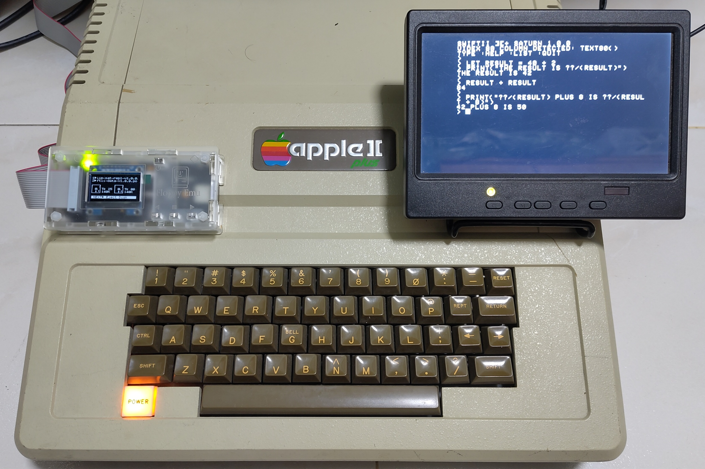
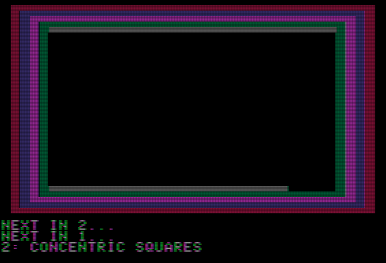

# SwiftII

**A Swift-flavored mini development environment for the Apple II.** 

SwiftII supports an implementation of `let`/`var`, optionals, type inference, string interpolation, arrays, functions. A real, bytecode-compiled language that boots from a 140 KB floppy and runs on a 1 MHz 6502, from an original Apple ][ and up in ProDOS 2.4.3.

Both a REPL and bytecode compiler/runner setups are provided depending on disk.

```
SwiftII //e 1.0.1
> let result = 40 + 2
> print("the result is \(result)")
the result is 42
> result + result
84
> print("\(result) plus 8 is \(result + 8)")
42 plus 8 is 50
```

The **//e** has a lowercase keyboard, so you type that as-is. An uppercase-only **][+** has no lowercase and no `\`, so you type the *same* session with digraphs (`??/` is `\`) — SwiftII reads it back as the canonical Swift above. That's exactly what's on the real ][+ screen in the photo below:

```
SWIFTII ][+ 1.0.1
> LET RESULT = 40 + 2
> PRINT("THE RESULT IS ??/(RESULT)")
THE RESULT IS 42
> RESULT + RESULT
84
> PRINT("??/(RESULT) PLUS 8 IS ??/(RESULT + 8)")
42 PLUS 8 IS 50
```

<p align="center">
  <br>
  <sub><em>That's a real Apple II+.</em></sub>
</p>

It's inspired by **Apple Pascal** - the UCSD Pascal system that, back in 1979, compiled to bytecode on a virtual machine to bring a serious structured language to the Apple II. SwiftII does the same thing for **Swift** - the modern language behind so many of the apps today's Apple machines run - bringing a small taste of it to the 6502.

Boot a disk and you land in a **launcher**: an interactive **REPL**, a **file browser** that runs `.swift` programs straight off the disk, and a full-screen **editor** - all self-contained on one bootable floppy.

Bigger programs compile ahead of time: an **on-disk compiler** streams a `.swift` source from disk and emits a `.swb` bytecode file, which a companion **runner** then executes - so programs run larger than the REPL holds. How much larger depends on the disk: a stock II+ or //e keeps the bytecode flat in main memory, a II+ with a **Saturn 128K** pages it through the card's banks, and a //e pages it into **aux RAM** - three [tiered limits](docs/using/LANGUAGE.md#implementation-limits), lifted by the extra RAM.

And it runs in **64 KB**: the lite system fits a stock 64 KB Apple II, while the extras (graphics, memory, sound) add a 128K Saturn or 64K //e aux card. Either way, every SwiftII binary lives inside the 40,704-byte ProDOS ceiling - a budget that is half the fun (see [how it's built](#how-its-built)).

* Writeup: https://yeokhengmeng.com/2026/06/swift-on-apple-ii/
* Usage video: https://www.youtube.com/watch?v=GFuMG0EhEWo
* Acceptance test runner: https://www.youtube.com/watch?v=_bgV1I8DhJs

---

## What you get

- **A REPL**: meta-commands, auto-printed expressions, input history on the //e.
- **An editor + file browser** in the launcher: write, save, and run a `.swift` without ever leaving the disk.
- **A compiler + runner** for larger programs: the compiler streams source from disk, the runner executes the bytecode, with tiered bytecode limits.
- **Apple II hardware from Swift:** low-res graphics, `peek`/`poke`, speaker tone plus file/directory I/O.
- **Runs on real iron**:
  * Original ][ (Integer BASIC ROM and all) through //e
  * 80-column text on //e firmware or a II+ Videx
  * Graphics and memory access with a Saturn 128K or //e aux card. 
  * Physical testing so far is on a II+ with Saturn. See the [coverage note](#on-real-hardware).

<table>
<tr>
<td width="50%"><br><sub>The boot <strong>launcher</strong></sub></td>
<td width="50%"><br><sub>The full-screen <strong>editor</strong> (//e, 80-column)</sub></td>
</tr>
<tr>
<td width="50%"><br><sub>The <strong>file browser</strong> + live code preview</sub></td>
<td width="50%"><br><sub><code>xsnake</code> — a playable light-cycle game</sub></td>
</tr>
<tr>
<td width="50%"><br><sub>All <strong>16 lo-res colours</strong> — <code>gr</code>/<code>color</code>/<code>vlin</code></sub></td>
<td width="50%"><br><sub><code>xgrdemo</code> — a lo-res colour <strong>graphics</strong> showcase <em>(GIF ~2× real speed; a real Apple II runs it slower)</em></sub></td>
</tr>
</table>

---

## Try it

### Run a prebuilt disk - no toolchain needed

Download a disk image (`.po`) from the [GitHub Releases](https://github.com/yeokm1/swiftii/releases) assets and open it in an Apple II emulator - **Mariani** on macOS, **AppleWin** on Windows, or [**izapple2**](https://github.com/ivanizag/izapple2/releases) (cross-platform).

Start with `swiftii-iip-lite-repl` (release assets append the version, e.g. `swiftii-iip-lite-repl-v1.0.1.po`) for the basic II+ REPL - it boots straight to the launcher. Pick another disk from the [table below](#on-real-hardware) for graphics, memory access, speaker clicks, sound in compiled programs, or the compiler.

Want to build it yourself? See [Build from source](#build-from-source).

### Five demos to start with

| Demo | Disk | Shows off |
|------|------|-----------|
| [`fizzbuzz`](progdisk/samples/fizzbuzz.swift) | any (lite) | `while`, `if`/`else if`/`else`, `%`, `print` - the universal first program |
| [`functions`](progdisk/samples/functions.swift) | any (lite) | positional params, `square`/`power`, bounded recursion, `min`/`max` |
| [`xcolors`](progdisk/xsamples/xcolors.swift) | extras (Saturn / //e aux) | **all 16 lo-res colours** as vertical bands: `gr`, `color`, `vlin` |
| [`xsnake`](progdisk/xsamples/xsnake.swift) | extras (Saturn / //e aux) | a **playable GR game** - live `peek`/`poke` keys, `scrn()` self-collision |
| [`xdice`](progdisk/fbsamples/xdice.swift) | Family B compiler | the big-language trio: `random(in:)`, `switch`, `for-in` over an array |

The full catalogue is in [`progdisk/README.md`](progdisk/README.md).

---

## On real hardware

A SwiftII disk is a standard 140 KB ProDOS 5.25" image. Grab a prebuilt `.po` from the [GitHub Releases](https://github.com/yeokm1/swiftii/releases) assets (or build the set yourself - see [Build from source](#build-from-source)). Write one to a floppy with **ADTPro**, or run it from a **floppy emulator** (BMOW Floppy Emu, CFFA3000). Each disk is `swiftii-….po` (release assets append the version, e.g. `swiftii-iip-lite-repl-v1.0.1.po`); pick the one for your machine:

| Disk | For | You get |
|------|-----|---------|
| `…-iip-lite-repl` | any ][ / ][+ | core language REPL |
| `…-iip-sat-repl` | ][+ with Saturn 128K | core **+ graphics, memory, speaker click + 80-col (Videx)** |
| `…-iie-lite-repl` | //e | core + native lowercase / 80-column |
| `…-iie-aux-repl` | //e with 64K aux | core **+ graphics, memory, speaker click + 80-col** |
| `…-{iip,iip-sat,iie,iie-aux}-compiler` | ][+ / Saturn / //e | **Family B**: on-disk compiler + runner |
| `swiftii-data` | drive 2 | samples + the on-disk test suite |

Two drives (or a Floppy Emu in dual-disk mode) keep a program disk in drive 1 and your `.swift`/`.swb` files on the data disk in drive 2; single-drive machines still get `SAMPLES/` on every disk. Step-by-step in the [tutorial](docs/using/TUTORIAL.md).

**Original Apple ][ (1977):** it runs SwiftII too - the lite II+ disk and binaries work unchanged - as long as it's upgraded to **48K RAM plus a 16K Language Card** (64K total).

Its ROM has no Autostart, so it won't boot a disk on power-up: at the monitor `*` prompt (press **Ctrl-Reset** if you're not already there), type **`C600G`** and Enter to boot the Disk II in slot 6 (or `PR#6` from a BASIC `]` prompt).

> **Hardware coverage.** Real-iron testing is done on an **Apple II+ with a Saturn 128K card and a Videx Videoterm** only. Every other supported configuration (//e lite, //e aux, original ][, bare-64K //e, Family B compiler disks) is exercised extensively under emulation but has not been run on physical hardware - see [`docs/testing/TESTING.md`](docs/testing/TESTING.md#verified-vs-owed).

---

## The language

A deliberate subset - small enough to fit, close enough that a Swift programmer reads it on sight.

```swift
let answer = 42                  // Int (16-bit), inferred
var count = 0

let maybe: Int? = 5              // optionals
if let x = maybe { print(x) }
let n = maybe ?? 0

while count < 10 { count += 1 }  // control flow
for i in 0..<5 { print(i) }
if count > 0 && count < 100 { print("in range") }  // && / || short-circuit

func greet(name: String) -> String {   // functions, positional args
    return "Hello, \(name)!"
}

var xs = [1, 2, 3]               // arrays
xs.append(4)
print(xs.count)
```

The extras binaries and the on-disk compiler add string/`Int` conversions, more array methods (`removeLast`/`removeAll`/`contains`), low-res graphics (`gr`/`plot`/`hlin`/…), and `peek`/`poke`; compiled Family B programs also add sound (`tone`) and file I/O.
**Deliberately out of scope:** floating-point, closures, dictionaries, and call-site argument labels.

→ [cheat sheet](docs/using/CHEATSHEET.md) · [API reference](docs/using/API.md) · [full language spec](docs/using/LANGUAGE.md)

### Typing Swift on a 1978 keyboard

Canonical `.swift` is lowercase ASCII everywhere. On an uppercase-only ][+, an input layer auto-lowercases what you type, `'` marks one capital, Ctrl-W gives `_`, and C-standard digraphs cover the missing keys (`<%`/`%>` → `{`/`}`, `<:`/`:>` → `[`/`]`, `??/` → `\`). The //e types normally. The full table is in the [cheat sheet](docs/using/CHEATSHEET.md) and the [language spec](docs/using/LANGUAGE.md#typing-on-apple-ii-plus).

---

## How it's built

Portable **C90** (ANSI C89, the subset cc65 accepts), compiled two ways: **clang** for the host (where the tests run) and **cc65** for the Apple II (where it ships).

A single-pass **Pratt** compiler emits bytecode straight to a stack **VM** - no AST, because there's no room for one (the VM design follows *Crafting Interpreters*, Part III). All hardware sits behind a thin platform layer, so the whole language runs and is tested on the host with the Apple II stubbed out.

The 64 KB ceiling shapes everything: the interpreters split the language across MAIN and the 16 KB language card; the extras binaries exile cold code to a Saturn bank or //e aux RAM; the Family B compiler streams source through a 4 KB window and raises bytecode capacity by tier.

→ [ARCHITECTURE.md](docs/contributing/ARCHITECTURE.md) for the full picture.

---

## Build from source

For contributors and anyone who wants the toolchain. Needs macOS 13+, Xcode Command Line Tools, and Homebrew.

```sh
./scripts/setup.sh   # installs cc65, py65, AppleCommander + the ProDOS template
make run             # build the II+ disk and boot it in Mariani
make disks           # build all nine .po images into build/disk/
```

```sh
make test    # C unit tests (clang, ASan/UBSan)
make sim     # run the cc65 build on a py65 6502 simulator
make ci      # everything + cc65 binaries + size budgets + disks
```

Compile a `.swift` to a `.swb` on your Mac with the host cross-compiler - the same format the on-disk compiler emits ([SWB.md](docs/contributing/SWB.md)):

```sh
make swbc
build/host/swbc hello.swift hello.swb   # copy to a data disk, run with the Runner
```

The `run-*` emulator targets default to Mariani; the `run-iz-*` targets need [izapple2](https://github.com/ivanizag/izapple2/releases) on your `PATH` (or `IZAPPLE2=/path/to/it`). Full target list in [`emulator/run.sh`](emulator/run.sh); contributor setup in [BUILDING.md](docs/contributing/BUILDING.md).

---

## Documentation

- **Using SwiftII** - [tutorial](docs/using/TUTORIAL.md) · [cheat sheet](docs/using/CHEATSHEET.md) · [API reference](docs/using/API.md) · [language spec](docs/using/LANGUAGE.md) · [feature/cost table](docs/using/FEATURES.md)
- **Working on it** - [DEVELOPING](docs/contributing/DEVELOPING.md) (start here) · [ARCHITECTURE](docs/contributing/ARCHITECTURE.md) · [CONSTRAINTS](docs/contributing/CONSTRAINTS.md) · [ROADMAP](docs/contributing/ROADMAP.md) · [repo layout](docs/contributing/PROJECT_LAYOUT.md)
- **Testing** - [test layers](docs/testing/TESTING.md) · [on-target playbooks](docs/testing/)
- **Screenshots** - [the gallery](docs/screenshots/) (mostly generated by [`make screenshots`](tools/host/screenshots/); lo-res colour stills are Mariani captures)

All indexed in [`docs/`](docs/README.md).

---

## License & acknowledgements

MIT.

SwiftII was built with AI assistance, working under the direction of **Yeo Kheng Meng** - who set the architecture, made the hard calls (the 64K budget, the disk layout, what ships and what doesn't), and steered every step. The AI did much of the typing; the design and judgement are his.

- Bob Nystrom's *Crafting Interpreters* - the bytecode VM is lifted almost wholesale from Part III.
- The cc65 project, for keeping a serious 6502 C toolchain alive for three decades.
- Steve Wozniak, for the machine. The Swift team, for the language.
