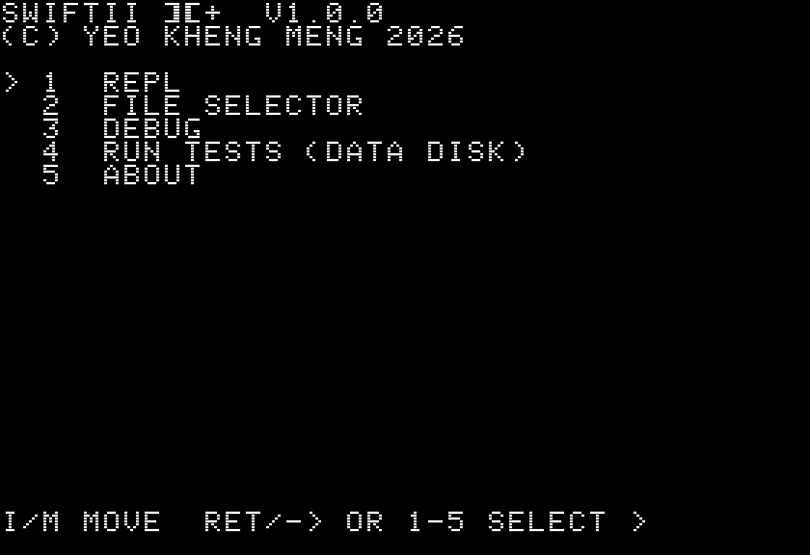
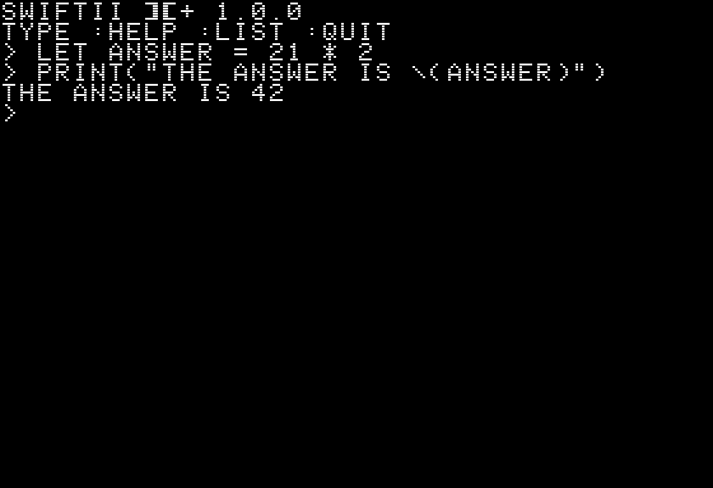
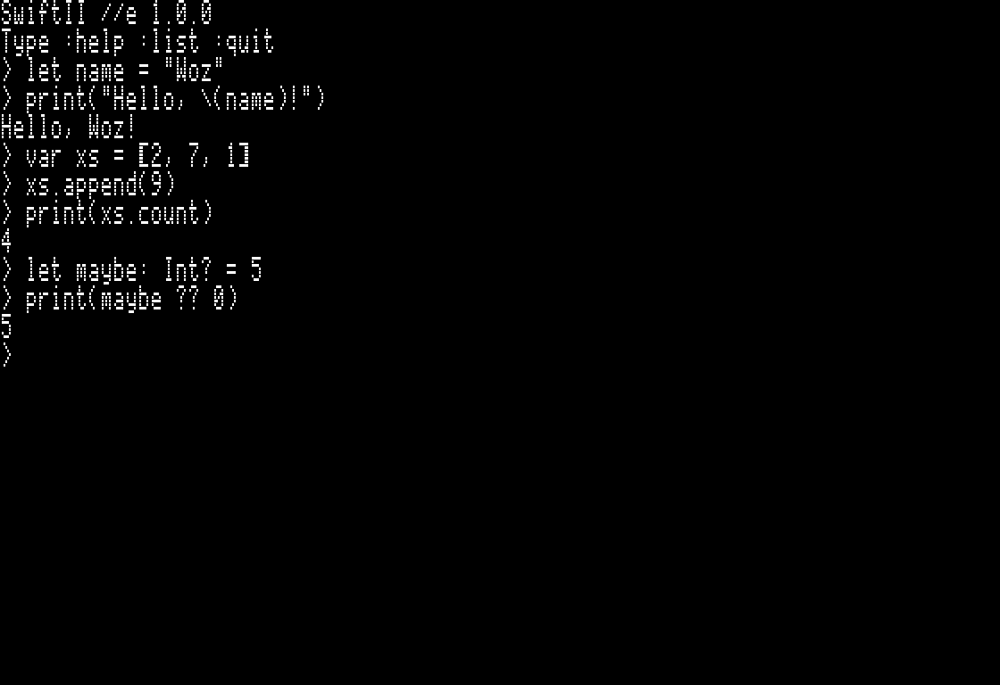
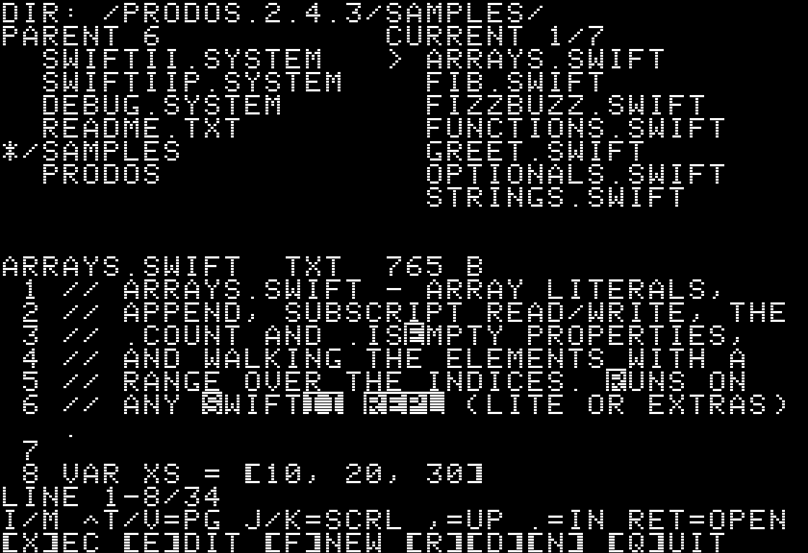
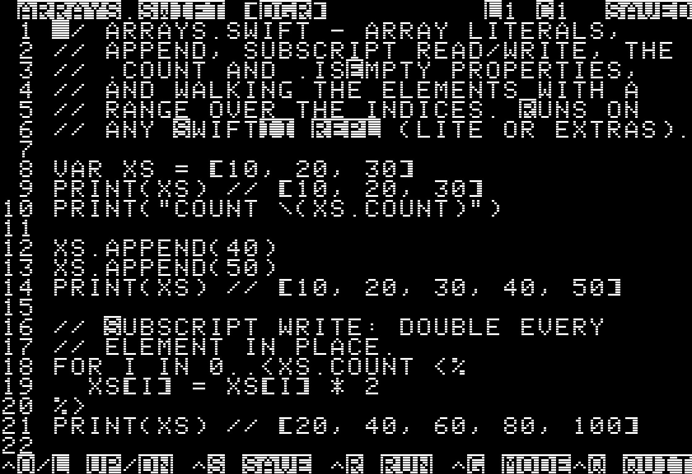
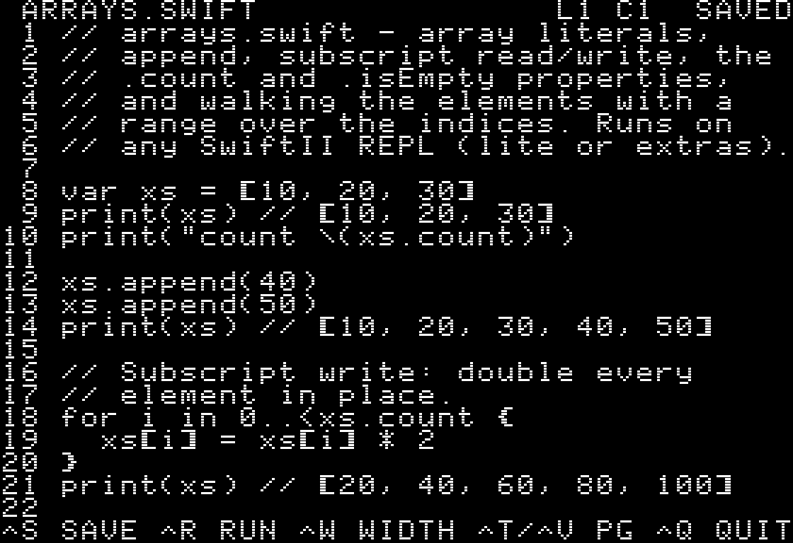
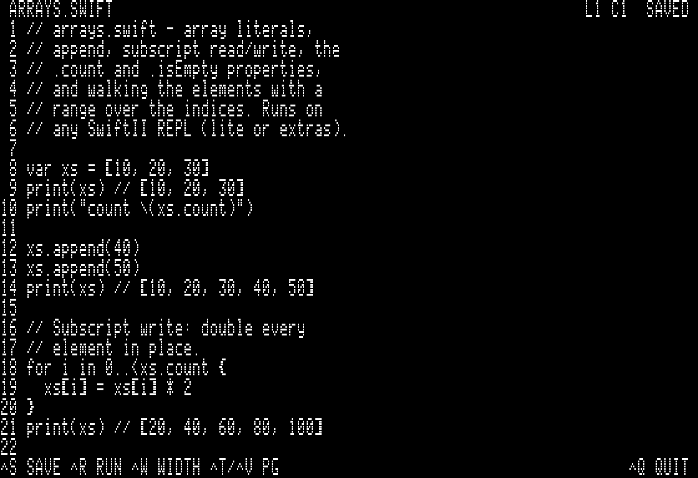
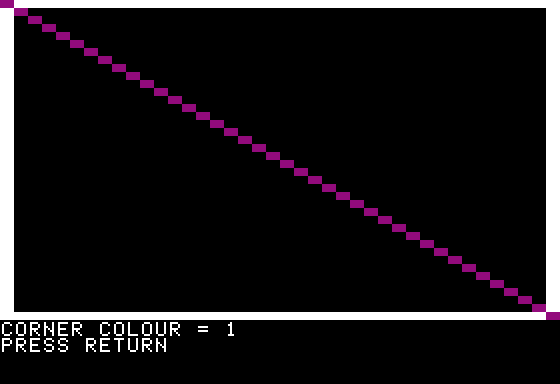
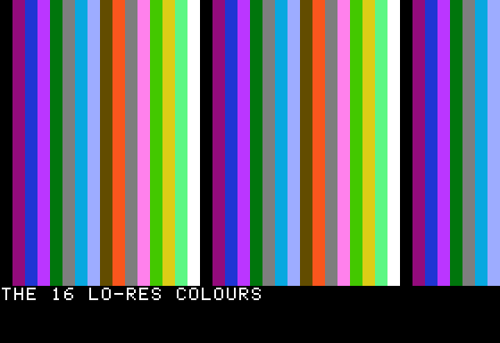
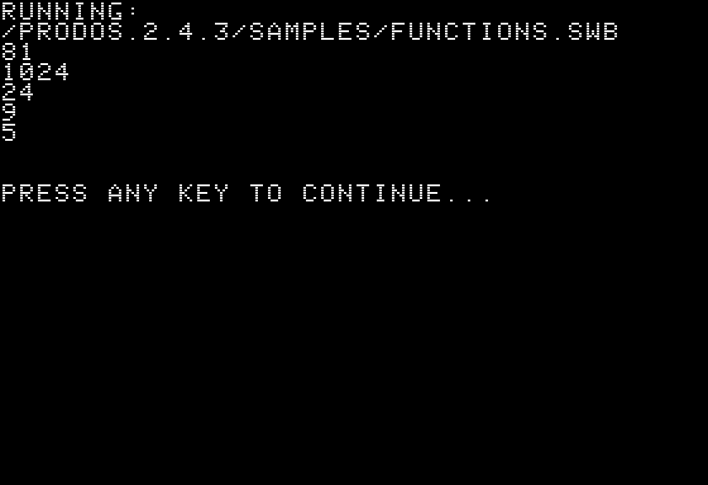

# SwiftII tutorial

A hands-on introduction for **users** - how to boot SwiftII, type at the
prompt, write and run a program, and reach the graphics and "bigger
programs" features. No prior Apple II or Swift experience assumed. (If
you're here to *build* SwiftII or hack on its source, read the
[developer getting-started guide](../contributing/DEVELOPING.md) instead.)

SwiftII is a small Swift-like language that runs on a real (or emulated)
**Apple ][ / ][+ / //e**. It ships as a set of bootable floppy images;
each disk carries one interpreter plus a launcher, an editor, and demo
programs.

---

## 1. Pick a disk and boot it

SwiftII ships as **eight `.po` disk images**. For a first session, the
plain II+ lite disk is the simplest:

| You have… | Boot this disk | What you get |
|-----------|----------------|--------------|
| Any Apple ][ or ][+ | `swiftii-iip-lite-repl.po` | core language (REPL) |
| II+ with a Saturn 128K card | `swiftii-iip-sat-repl.po` | core **+ graphics / memory / speaker click + 80-col (Videx)** |
| Any //e | `swiftii-iie-lite-repl.po` | core language (REPL) |
| //e with 64K aux (80-col card) | `swiftii-iie-aux-repl.po` | core **+ graphics / memory / speaker click + 80-col** |

You can run a disk in an emulator from the source tree, or put it on real
hardware (next subsections):

```sh
make run        # II+ lite in Mariani
make run-sat    # II+ Saturn disk in the configured/default emulator
make run-aux    # //e aux disk in the configured/default emulator
```

Use `make run-iz-sat` or `make run-iz-iienh` when you specifically need
the scripted izapple2 Saturn / //e aux profiles.

The disk boots straight to the **launcher menu**.

### Where to get the disks

You don't have to build them. The ready-to-use `.po` images are:

- in the **[`releases/`](../../releases)** directory of the source tree, and
- attached to each tagged
  **[GitHub Release](https://github.com/yeokm1/swiftii/releases)** (the
  *Assets* of the latest release).

Download the eight images (four REPL disks, one data disk, three Family B
compiler disks) from either place. (To build them yourself instead, run
`make disks` - they land in `build/disk/`.)

### Running on real hardware

A SwiftII disk is a standard **140 KB ProDOS 5.25" image** (`.po`). Two
ways onto an Apple II:

- **A real 5.25" floppy.** Write the `.po` to a blank disk with **ADTPro**
  (serial/audio transfer from a modern computer to the Apple II's drive),
  then boot it.
- **A floppy emulator** (e.g. **BMOW Floppy Emu**, or a CFFA/MicroDrive).
  Copy the `.po` files to the device's SD card, pick the image from its
  menu, and boot. For the Floppy Emu, use its **Disk II (5.25") mode** -
  ProDOS `.po` images are 5.25" disks.

**Using a program disk *and* the data disk at once.** Some things (the
on-disk `TESTS/` suites, the extra `SAMPLES/`) live on the separate
**data disk** in **drive 2**. To have both online together, you need two
drives:

- Put the program disk in drive 1 and the data disk in a **second
  physical drive** (drive 2), **or**
- set your **Floppy Emu to dual-disk mode** (if your model/firmware
  supports emulating two 5.25" drives) so it presents the program disk as
  drive 1 and the data disk as drive 2.

If you only have one drive, that's fine - every program disk already
carries its own `SAMPLES/`, so you can learn and run demos without the
data disk. The data disk is only needed for the test suites and the full
sample set.

---

## 2. The launcher menu

Every disk auto-starts `SWIFTII.SYSTEM`, a menu:

```
  1  REPL          interactive prompt
  2  FILE SELECTOR browse + run programs, open the editor
  3  DEBUG         hardware diagnostic
  4  RUN TESTS     run the data-disk test suite
  5  ABOUT         version + the disk set
```

Press **1** to start the REPL. You can also move the `>` highlight with
**I** (up) / **M** (down) and activate it with **Return**, the **right-arrow**,
or its number key.



> On a **Family B compiler disk** the menu is slightly different (no REPL -
> those disks compile programs instead). We get to that in section 7.

---

## 3. Your first REPL session

The REPL ("read-eval-print loop") runs what you type, line by line. The
prompt is `> `.

```
SwiftII ][+ 1.0.0
Type :help :list :quit
> 1 + 2
3
> print("Hello, Apple II!")
Hello, Apple II!
```

A bare expression like `1 + 2` is **printed automatically**. Anything you
`print(…)` is shown too.



On a **//e** the same session reads in natural lowercase:



**Variables** - `let` is a constant, `var` can change. Declarations are
silent (no echo):

```
> let name = "Woz"
> var count = 0
> count = count + 1
> count
1
```

**String interpolation** drops a value into a string with `\(…)`:

```
> print("Hi \(name), count is \(count)")
Hi Woz, count is 1
```

### Typing on an Apple ][ / ][+

> This subsection is **only for the ][ / ][+**. On a **//e** the keyboard
> types lowercase, uppercase, and every symbol directly - skip ahead.

The ][+ keyboard has **no lowercase**, and can't type `{ } [ ] \ _ |` at
all. SwiftII handles both for you: you type normally and it stores
canonical lowercase Swift. Three rules cover the rest:

- **Uppercase:** press **`'`** (apostrophe) before a letter for one
  capital - `'INT` → `Int`. Use **`''`** for a run of capitals through the
  next non-letter - `''MAX` → `MAX`. (Inside a string, `'` between two
  letters is a literal apostrophe, so `"DON'T"` → `"don't"`.)
- **Underscore:** **Ctrl-W** gives `_` (the same key the editor uses).
- **Brackets and slashes** - the keys the ][+ lacks - use these
  two/three-key **digraphs**:

  | Type | Get | | Type | Get |
  |------|-----|-|------|-----|
  | `<%` | `{` | | `:>` | `]` |
  | `%>` | `}` | | `??/` | `\` |
  | `<:` | `[` | | `??!` | `\|` (reserved) |

On a ][+, lowercase letters render as **normal** uppercase and real
capitals as **inverse** uppercase, and `{ } |` show as their digraph
forms - so `readLine` appears with just its `L` in inverse video. The
**stored bytes are always plain lowercase ASCII**, identical on every
machine. Full rationale is in [LANGUAGE.md](LANGUAGE.md), the "Typing on
Apple II Plus" section.

If you mistype, the **left-arrow** (Backspace) key deletes the character
to its left. On a **//e** the **up / down arrows** recall your previous
input lines so you can re-run or edit them.

### Useful REPL commands

These start with `:` and aren't part of the language:

| Command | Does |
|---------|------|
| `:help` | list the commands |
| `:list` | show your current variables |
| `:mem`  | how much memory is free |
| `:reset`| clear everything and start fresh |
| `:quit` | leave the REPL (or **Ctrl-D** on an empty line) |

---

## 4. The language in ten minutes

Everything below works at the REPL. Each block-defining construct
(`if` / `while` / `for` / `func`) must fit on **one line** in the REPL -
use `;` to separate statements. For longer programs, use the editor (section 6).

**Conditionals:**

```
> let n = 7
> if n % 2 == 0 { print("even") } else { print("odd") }
odd
```

**Loops** - `while`, and `for-in` over a range:

```
> var i = 1; while i <= 3 { print(i); i = i + 1 }
1
2
3
> for j in 1...3 { print(j * j) }
1
4
9
```

**Functions:**

```
> func square(_ x: Int) -> Int { return x * x }
> square(9)
81
```

**Arrays:**

```
> var xs = [10, 20, 30]
> xs.append(40)
> print(xs.count)
4
> for i in 0..<xs.count { print(xs[i]) }
10
20
30
40
```

**Optionals** - a value that might be missing (`nil`). `if let` unwraps it:

```
> let maybe = Int("42")
> if let v = maybe { print(v * 2) } else { print("not a number") }
84
```

**Reading input** - `readLine()` returns an optional `String`:

```
> print("Your name?"); let who = readLine() ?? "friend"
> print("Hello, \(who)!")
```

That's most of the language. The full reference is
[LANGUAGE.md](LANGUAGE.md).

---

## 5. Running the demo programs

Quit the REPL (`:quit`) and pick **2 FILE SELECTOR** from the menu. You'll
see the files on the disk, including a `SAMPLES/` folder.

- Move the highlight with the **up / down** (or J / K) keys; the pane on
  the right **previews** the highlighted file.
- Press **X** to **run** a highlighted `.swift` program.
- Press **`,`** to switch drives (drive 2 = the data disk, with more
  samples and tests).



Try `SAMPLES/FIZZBUZZ.SWIFT` - press X and watch it run, then return to
the launcher. Five demos worth starting with are listed in the
[README](../../README.md) ("Five demos to start with").

---

## 6. Writing your own program (the editor)

From the file selector:

- Press **F** to start a **new file**, or highlight a file and press
  **E** (or **Return**) to **edit** it.

The editor is a simple full-screen text editor:

| Key | Action |
|-----|--------|
| (type) | insert text |
| arrows | move the cursor (non-destructive, like Apple Pascal) |
| Ctrl-D / Delete | delete left (backspace) |
| Ctrl-A / Ctrl-E | start / end of line |
| Ctrl-S | save |
| **Ctrl-R** | **save and run** |
| Ctrl-Q | back to the file browser |

On a ][+, **Ctrl-W** types an underscore (`_`) — the keyboard has no `_`
key — and **Ctrl-G** toggles Swift (digraph) ↔ raw-text mode.

On a ][+, the editor renders your text the same way the prompt does (the
typing notes under section 3): lowercase shows as **normal** uppercase and
capitals as **inverse** uppercase, so you can read the case of every letter
even though the screen has no real lowercase. The saved file is always plain
lowercase ASCII. The //e shows real lowercase.

The same file in the editor on a ][+ (40-column, uppercase) and a //e
(40-column with real lowercase):




On a //e, **Ctrl-W** switches the editor to 80 columns:



Type a short program:

```swift
let name = "Apple II"
var total = 0
for i in 1...10 {
  total = total + i
}
print("Hello from \(name)!")
print("1 + 2 + ... + 10 = \(total)")
```

Press **Ctrl-R** - it saves and runs, prints the result, and waits for a
key before returning to the editor. (Programs in a file can span multiple
lines freely, unlike the one-line REPL.)

---

## 7. Graphics, memory, and speaker clicks (extras disks)

Boot an **extras** disk (`swiftii-iip-sat-repl.po` with a Saturn card, or
`swiftii-iie-aux-repl.po` on a //e with aux RAM). These add Apple II platform
features the lite disks leave out.

**Low-resolution colour graphics** - a 40×40 grid of 16 colours:

```swift
gr()              // enter graphics mode
color(15)         // white
hlin(0, 39, 0)    // a horizontal line, top edge
color(1)          // magenta
plot(20, 20)      // one dot
text()            // back to text
```



`color(_:)` takes a value 0-15 - the full lo-res palette. A short loop over
`vlin` paints them as vertical bands - `color(x % 16)` cycles the palette and
`vlin` fills each column top to bottom. That program ships as a sample, so you
can run it straight from the file browser instead of typing it: highlight
`XSAMPLES/XCOLORS.SWIFT` and press **X**.



`XSAMPLES/XGRAPHICS.SWIFT` is a guided tour of the GR builtins, and
`XSNAKE.SWIFT` is a playable game (steer with the I / J / K / M diamond) -
a light-cycle that leaves a permanent trail:


> The shot above is from the Mariani emulator's RGB-monitor render (crisp lo-res
> colour); on a composite monitor or TV the colours bleed a little, which is part
> of the period look. See the [screenshots README](../screenshots/README.md).

**Sound and memory** - `poke` writes a byte to a memory address;
`$C030` (49200 in decimal) is the speaker:

```swift
poke(49200, 0)    // one click
let key = peek(49152)   // read the keyboard byte
```

**80 columns** - on a //e, or on the II+ `SWIFTSAT` REPL path with both
Saturn and a Videx Videoterm, `text80()` switches to an 80-column display and
`text()` returns to 40. The flat II+ Family B Runner can also drive Videx for
program output. The launcher's **W** key toggles 40/80 on //e; the II+ launcher
stays 40-column.

The full platform surface (`htab`/`vtab`, `scrn`, `color`, …) is in
[LANGUAGE.md](LANGUAGE.md) the "Apple II Platform Built-ins" section.

---

## 8. Bigger programs: the Family B compiler

The REPL keeps your whole program in memory, so it's bounded by RAM. For
**bigger** programs there's a separate **compiler** disk set
(`swiftii-iip-compiler.po`, `swiftii-iip-sat-compiler.po`,
`swiftii-iie-compiler.po`). These don't have a REPL - instead they
**compile** your `.swift` source to a compact `.swb` file, then **run**
it:

1. Boot a compiler disk and pick **1 FILE SELECTOR**.
2. Open a `.swift` file in the editor (**E**), write your program, and
   press **Ctrl-R** - it **compiles and runs** in one step.
3. A `.swb` file appears next to your source. Press **X** on the `.swb`
   later to re-run it **without** recompiling.



The compiler disks also unlock a few extra language features (`switch`,
`for-in` over arrays, `random(in:)`, and file read/write) - see
`XSAMPLES/XDICE.SWIFT` on the data disk for a tour. The three tiers (II+,
II+ Saturn, //e aux) increase how big a program you can compile.

---

## 9. Keyboard reference

Every key in one place. (`Ctrl-X` means hold Control and press X.)

**Launcher menu** - move the highlight with `I` / `M` and activate it with
`Return`, the `→` right-arrow, or its number key:

| REPL disk | Compiler disk | Opens |
|-----------|---------------|-------|
| `1` | - | REPL (interactive prompt) |
| `2` | `1` | File selector |
| `3` | `2` | Debug (hardware diagnostic) |
| `4` | `3` | Run tests (data disk) |
| `5` | `4` | About |

**File selector:**

| Key | Action |
|-----|--------|
| ↑ / ↓ (or `J` / `K`) | move the highlight (previews the file) |
| `Return` | open in the editor (or launch a `.SYSTEM` file) |
| `X` | **run** - REPL disk: run a `.swift`; compiler disk: compile a `.swift` to `.swb` and run it (or run a `.swb` directly) |
| `E` | edit the highlighted file |
| `F` | new file | 
| `R` | rename · `D` delete · `N` new folder |
| `,` | re-pick the drive (drive 2 = data disk) |
| `W` | toggle 40/80 columns (**//e** / Videx only) |

**Editor:**

| Key | Action |
|-----|--------|
| (type) | insert text |
| ← / → | move left / right (non-destructive) |
| `Ctrl-D` / `Delete` | delete left (backspace) · **//e** `Delete` key too |
| `Return` | new line |
| `Ctrl-O` / `Ctrl-L` (or ↑ ↓) | move up / down a line — `Ctrl-O`/`Ctrl-L` is the Apple Pascal convention (O sits above L) |
| `Ctrl-A` / `Ctrl-E` | start / end of line |
| `Ctrl-T` / `Ctrl-V` | page up / down |
| `Ctrl-W` | `_` in Apple ][+ Swift mode (no `_` key on the keyboard) |
| `Ctrl-G` | Apple ][+: toggle Swift (digraph) ↔ raw-text mode |
| `Ctrl-S` | save |
| `Ctrl-R` | save and run (compiler disk: save + compile + run) |
| `Ctrl-Q` | back to the file browser (open another file from there) |

**REPL:**

| Key / command | Action |
|---------------|--------|
| `Backspace` / ← | delete left |
| ↑ ↓ (or `Ctrl-P` / `Ctrl-N`) | recall earlier input lines (**//e** only) |
| `Ctrl-D` | quit (EOF, on an empty line) |
| `:help` | list the meta-commands |
| `:list` | show current variables |
| `:mem` | free memory |
| `:reset` | clear everything |
| `:quit` | leave the REPL |

**Debug diagnostic:** ← → arrows page through the four screens; `Esc`
exits.

The ][+ typing keys (`'`, `''`, `Ctrl-W`, and the `<%` `%>` `<:` `:>`
`??/` digraphs) are in section 3 above.

---

## 10. Where to go next

- **[LANGUAGE.md](LANGUAGE.md)** - the complete language reference.
- **[README](../../README.md)** - the disk set, the showcase demos, and the
  emulator commands.
- **On-disk Help** - each disk has a `README.TXT` (the launcher's About
  screen points to it) with the menu and editor keys for that disk.
- **[FEATURES.md](FEATURES.md)** - every feature and what it costs, if
  you're curious why some features are on some disks and not others.

Have fun - you're programming a 1977 computer in a modern language. 🍎
